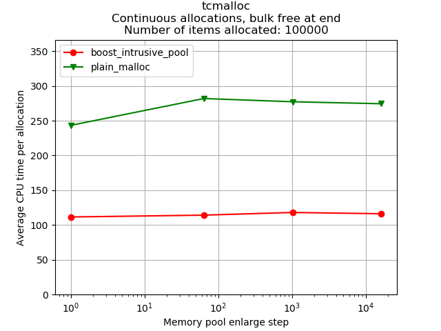
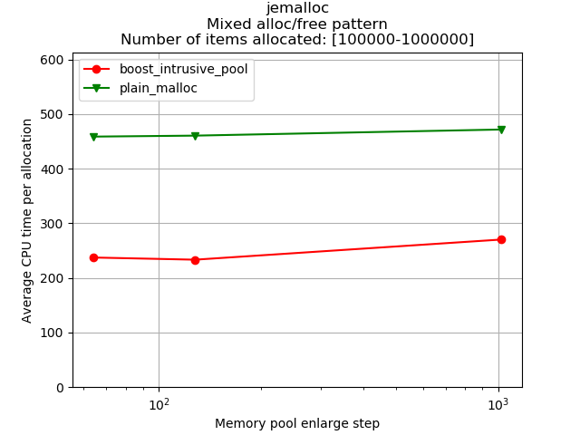

[](https://travis-ci.com/f18m/boost-intrusive-pool)

# Boost Intrusive Pool
This project provides a C++ memory pool that is Boost-friendly and performance oriented.

## Features and Limitations
The `boost_intrusive_pool` provides the following features:
 - smart pointer pool: once "allocated" from the pool items whose ref count goes to zero return
   automatically to the pool;
 - zero-malloc: after a resize of N items, no memory allocations are EVER done until M<=N active
   items are in use;
 - O(1) allocate;
 - O(1) destroy (pool return);
 - use of standard, well-defined smart pointers: `boost::intrusive_ptr<>`;
 - polymorphic-friendly pool: if A derives from `boost_intrusive_pool_item`, and B derives from A, the
   memory pool of B just works;
 - Header-only.
 - **Optional** standard construction: when items are allocated out of the pool via the 
   `boost_intrusive_pool::allocate_through_ctor()` the memory-pooled objects constructor is called; 
   C++11 perfect forwarding allows to pass optional parameters to the ctor routine;
 - **Optional** construction via alternative function: when items are allocated out of the pool via the 
   `boost_intrusive_pool::allocate_through_init()` API, the `init()` member function of the memory-pooled objects 
   is called; C++11 perfect forwarding allows to pass optional parameters to the `init()` routine;
 - **Optional** recycling via custom function: when the pool is constructed, a custom function `std::function` can be
   specified; when items return to the pool it will be called with the item being recycled as parameter; this allows
   to perform special cleanup like releasing handles, clearing data structures, etc;
 - **Optional** recycling via alternative function: when items return to the pool, the memory pool can be configured
   to invoke the `destroy()` member function of the memory-pooled objects; this allows
   to perform special cleanup like releasing handles, clearing data structures, etc;

Of course there are tradeoffs in the design that bring in some limitations:
 - requires all C++ classes stored inside the memory pool to derive from a base class `boost_intrusive_pool_item`;
 - provides `boost::intrusive_ptr<>` instead of the more widely-used `std::shared_ptr<>`:
   reason is that `std::shared_ptr<>` puts the reference count in a separate block that needs a separate allocation
   and thus memory pools based on `std::shared_ptr<>` (like https://github.com/steinwurf/recycle) cannot be
   zero-malloc due to the heap-allocated control block;
 - requires C++ classes stored inside the memory pool to have a default constructor: reason is that to ensure
   the spatial locality of allocated items (for better cache / memory performances) we use the new[] operator 
   which does not allow to provide any parameter;
 - adds about 24 bytes of overhead to each C++ class to be stored inside the memory pool.
 
The templated memory pool has been tested with C++14 and C++17 with recent GCC versions (7.x and 8.x).


# How to Install

Since this project is header-only it does not need any specific installation, just grab the latest release and put the
`boost_intrusive_pool.hpp` file in your include path.


# A Short Tutorial

TO BE WRITTEN.
Check [tests/tutorial.cpp](tests/tutorial.cpp).


# Example: Using the Default Constructor

In this example we show how to use memory-pooled objects that are initialized through their default constructor:

```
#include "boost_intrusive_pool.hpp"

void main()
{
	memorypool::boost_intrusive_pool<DummyClass> pool(4); // allocate pool of size 4
	   // this results in a big memory allocation; from now on instead it's a zero-malloc world:
	
	{
	    // allocate without ANY call at all (max performances):
	    boost::intrusive_ptr<DummyClass> hdummy = pool.allocate();
	
	    // of course copying pointers around does not trigger any memory allocation:
	    boost::intrusive_ptr<DummyClass> hdummy2 = hdummy;
	
	    // if we observed the pool now it would report: capacity=4, unused_count=3, inuse_count=1
	    
	    
	    // now instead allocate using the DummyClass default ctor:
	    boost::intrusive_ptr<DummyClass> hdummy3 = pool.allocate_through_ctor();
	    
	} // this time no memory free() will happen!

	// if we observed the pool now it would report: capacity=4, unused_count=4, inuse_count=0
}

```


# Example: Using a non-Default Constructor

In this example we show how to use memory-pooled objects that are initialized through their NON default constructor:

```
#include "boost_intrusive_pool.hpp"

void main()
{
	memorypool::boost_intrusive_pool<DummyClass> pool(4); // allocate pool of size 4
	   // this results in a big memory allocation; from now on instead it's a zero-malloc world:
	
	{
	    // now instead allocate using the DummyClass NON default ctor:
	    boost::intrusive_ptr<DummyClass> hdummy3 = pool.allocate_through_ctor(arg1, arg2, arg3);
	    
	} // this time no memory free() will happen!
}
```

# Performance Results

The following tables show results of some very simple benchmarking obtained on a desktop machine:

```
Intel(R) Core(TM) i5-4570 CPU @ 3.20GHz, 4 cores
16GB DDR3
libc-2.27 (Ubuntu 18.04)
```

The memory pool implementation is compared against a "no pool" solution, which justs uses directly the heap.
The benchmarks are then repeated considering 3 different memory allocators:
 - [GNU libc](https://www.gnu.org/software/libc/) default malloc/free
 - [Google perftools](https://github.com/gperftools/gperftools) also known as tcmalloc
 - [Jemalloc](http://jemalloc.net/)

You can find the source code under [tests/performance_tests.cpp](tests/performance_tests.cpp).

<table cellpadding="5" width="100%">
<tbody>
<tr>
<td>


</td>
<td>



</td>
</tr>
<tr>
<td>


</td>
<td>

Results show that with glibc allocator (regular malloc/free implementation), the use of a memory
pool results in up to 44% improvement (from an average of 134ns to about 76ns).
When Google's tcmalloc or jemalloc allocators are in use the improvement grows to 67% and 76% respectively.

This is important to show that even if your software is using an optimized allocator the memory pool
pattern will improve performances considerably.

</td>
</tr>

</tbody>
</table>

Another pattern, perhaps somewhat more realistic, has been benchmarked as well:

<table cellpadding="5" width="100%">
<tbody>
<tr>
<td>


</td>
<td>


</td>
</tr>
<tr>
<td>




</td>
<td>

These results show that with a pattern where malloc and free operations are scattered and "randomized" 
a little bit, regular allocators cannot avoid memory fragmentation and less spatial locality compared
to a memory pool implementation.
 
In particular improvements go from 40% (glibc) to 53% (jemalloc) and up to 73% (tcmalloc).

</td>
</tr>

</tbody>
</table>

Of course take all these performance results with care.
Actual performance gain may vary a lot depending on your rate of malloc/free operations, the pattern in which they happen,
the size of the pooled items, etc etc.


# About Thread Safety

The memory pool has no locking mechanism whatsoever and is not thread safe.
The reason is that this memory pool is performance oriented and locks are not that fast, specially if you have many
threads continuosly allocating and releasing items to the pool.
In such a scenario, the best from a performance point of view, is to simply create a memory pool for each thread.


# Other Memory Pools

This memory pool implementation has been inspired by a few other C++ implementations out there like:

- https://github.com/steinwurf/recycle
- https://thinkingeek.com/2017/11/19/simple-memory-pool/
- https://github.com/cdesjardins/QueuePtr
